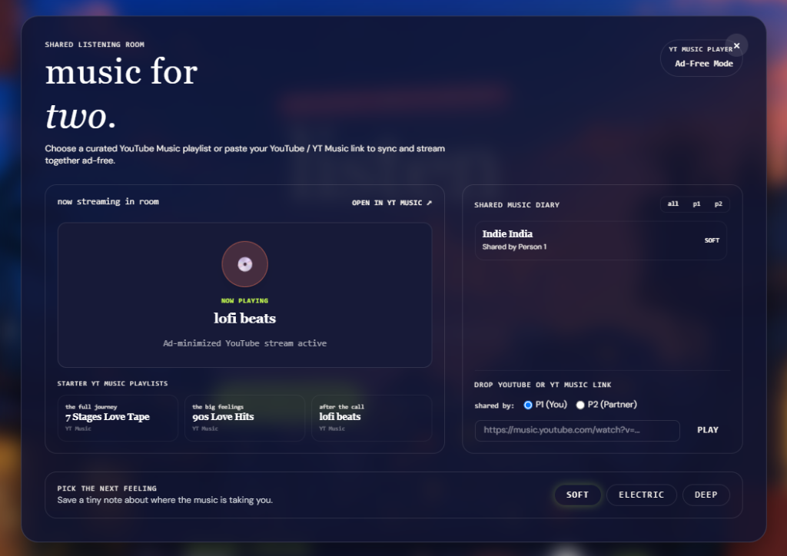
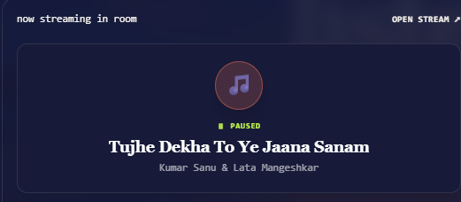
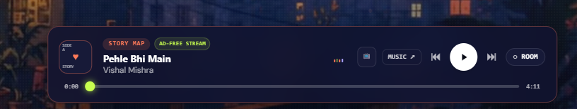
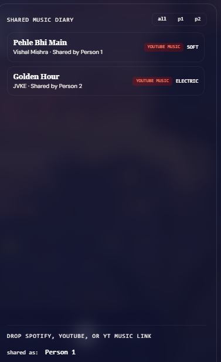

# 💖 Heartbeats Arcade (90s Heartbeat)

<div align="center">

[](https://90sheartbeat.vercel.app/)
[](https://react.dev/)
[](https://www.typescriptlang.org/)
[](https://supabase.com/)
[](https://tailwindcss.com/)
[](#license)

**An interactive, real-time shared music & video experience designed for two listeners to vibe together anywhere in the world.**

[🌐 Explore Live Site](https://90sheartbeat.vercel.app/) • [📖 Product Guide](#-product-guide--how-to-use) • [⚙️ Installation](#%EF%B8%8F-getting-started--local-development)

---

</div>

## 🌟 Overview

**Heartbeats Arcade** is a modern, retro-romantic music application built for couples and friends to listen, watch, and synchronize music playback in real time across different devices. 

Whether you're exploring the 7-stage interactive relationship story or hanging out in the **Shared Listening Room**, every action—track selection, play/pause, position seeking, and music diary additions—synchronizes instantly using **Supabase Realtime WebSockets**.

---

## 📸 Product Screenshots & Visual Walkthrough

### 1. Main Hero & Story Arcade Interface
> Experience the 20-second atmospheric ambient video background, dynamic song color themes, and interactive milestone arcade.



---

### 2. Shared Listening Room & Video Stream
> Stream 3 curated playlists or paste any YouTube / YT Music link to watch videos directly inside the interactive room player screen.



---

### 3. Professional Music Player Dock & Spinning Vinyl Disc
> Sleek bottom player bar featuring a spinning vinyl record disc (💿) that rotates when music is playing, a custom progress scrubber, and dynamic track color matching.



---

### 4. Shared Music Diary & Dual-Listener Persona Switcher
> Toggle between **P1 (You)** and **P2 (Partner)** to add songs, tag feelings (*Soft, Electric, Deep*), and keep a live shared music log.



---

## ✨ Key Features

- 📻 **3 Curated Room Playlists**:
  - **90s Love Hits** (*The Nostalgia*): 8 classic romantic tracks (*Tujhe Dekha To Ye Jaana Sanam*, *Pehla Nasha*, *Tum Hi Ho*, *Kal Ho Naa Ho*, etc.).
  - **Gen Z Chill Vibes** (*Late Night Scrolling*): 10 modern indie hits (*Golden Hour*, *Until I Found You*, *Sunflower*, *As It Was*, *Perfect*, *Heat Waves*, etc.).
  - **Lofi Beats** (*After Midnight*): 4 relaxing study & sleep lofi streams (*Lofi Girl*, *Cozy Rain*, *Coffee Shop Lofi*, etc.).

- ⚡ **Global Cross-Device Real-Time Sync**:
  - Powered by **Supabase Realtime WebSockets** (`broadcast` channels).
  - Instantly syncs `SYNC_TRACK`, `SYNC_PLAY_PAUSE`, `SYNC_SEEK`, and `SYNC_ADD_ENTRY` across iPhones, Androids, laptops, and desktops worldwide.

- 🎵 **Universal Link Resolver**:
  - Paste any **Spotify**, **YouTube**, or **YouTube Music** link.
  - Automatically resolves track titles, artists, thumbnails, and streams ad-free.

- 💿 **Rotating Vinyl Disc & Persistent Background Playback**:
  - Bottom player dock features a spinning vinyl disc (💿) that rotates during playback.
  - Closing the Shared Listening Room modal **never interrupts audio**—music continues playing smoothly in the background while you explore the site.

- 🎨 **Dynamic Theme Color Matching**:
  - Player Dock, Cassette Badges, and Topbar dynamically match the color accent of whichever track is currently playing.

- 🎯 **Feeling / Mood Redirection**:
  - `SOFT` ➔ Directly selects & plays **90s Love Hits**.
  - `ELECTRIC` ➔ Directly selects & plays **Gen Z Chill Vibes**.
  - `DEEP` ➔ Directly selects & plays **Lofi Beats**.

---

## 📖 Product Guide — How to Use

### Step 1: Open the Application
Navigate to [90sheartbeat.vercel.app](https://90sheartbeat.vercel.app/) or run locally at `http://localhost:5173`.

### Step 2: Choose Your Listener Persona
1. Click the **`◌ ROOM`** button in the bottom dock or top header.
2. Select **`P1 (You)`** on your device.
3. Have your partner open the same URL on their device and select **`P2 (Partner)`**.

### Step 3: Stream Music & Videos
- **Play Curated Playlists**: Click any track in *90s Love Hits*, *Gen Z Chill Vibes*, or *Lofi Beats*.
- **Add Custom Links**: Drop any Spotify, YouTube, or YT Music URL into the input box and click **Play**.
- **Listen Together**: Hitting Play/Pause, seeking the progress slider, or switching tracks syncs live on both devices!

### Step 4: Background Playback
- Close the room modal anytime. The music will continue playing seamlessly through the bottom player dock.
- Click the **`📺` TV button** or **spinning vinyl disc** on the player dock to reopen the video stream anytime!

---

## 🛠️ Tech Stack & Architecture

- **Frontend**: React 19, TypeScript, Vite
- **Styling**: Tailwind CSS v4, Custom CSS Animations & Glassmorphism
- **Real-Time Sync**: Supabase Realtime WebSockets (`@supabase/supabase-js`)
- **Audio/Video Engine**: YouTube IFrame API (`youtube-nocookie.com`) & Spotify oEmbed API
- **Deployment**: Vercel SPA Edge Hosting (`vercel.json`)

---

## ⚙️ Getting Started & Local Development

### Prerequisites
- Node.js `v18.0.0` or higher
- npm or yarn

### Installation Steps

1. **Clone the Repository**:
   ```bash
   git clone https://github.com/soumyadeepsarkar-2004/heartbeats-arcade.git
   cd heartbeats-arcade
   ```

2. **Install Dependencies**:
   ```bash
   npm install
   ```

3. **Configure Environment Variables**:
   Copy `.env.example` to `.env`:
   ```bash
   cp .env.example .env
   ```
   Add your free Supabase credentials (optional for cross-device testing):
   ```env
   VITE_SUPABASE_URL=https://uknmhlemnorzjiaitxwj.supabase.co
   VITE_SUPABASE_ANON_KEY=sb_publishable_fD32UZLJmd4_Odf4i1hRVg_WadLfYzq
   ```

4. **Start Development Server**:
   ```bash
   npm run dev
   ```
   Open `http://localhost:5173` in your browser.

5. **Build for Production**:
   ```bash
   npm run build
   ```

---

## 🔐 Environment Variables

| Variable Name | Required | Description |
| :--- | :--- | :--- |
| `VITE_SUPABASE_URL` | Yes | Your Supabase project URL |
| `VITE_SUPABASE_ANON_KEY` | Yes | Your Supabase publishable API key |

---

## 📄 License

Distributed under the MIT License. See `LICENSE` for more details.

---

<div align="center">

Made with ♥ for music lovers. Live at [90sheartbeat.vercel.app](https://90sheartbeat.vercel.app/)

</div>
